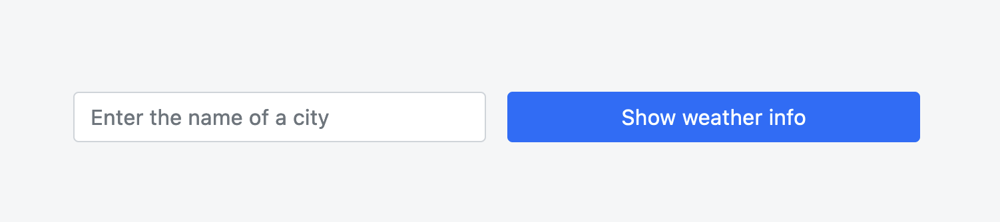

# Pre-Assignment: Weather Forecast
Weather Forecast is a service that shows weather forecast. 

[Demo](https://integrify-weather-makhova.netlify.app/)



## Used API's
1. https://developer.accuweather.com/accuweather-locations-api/apis/get/locations/v1/cities/search 
to search for a city by name and get the location key
2. https://developer.accuweather.com/accuweather-forecast-api/apis/get/forecasts/v1/daily/1day/%7BlocationKey%7D 
to get the forecast for the city

## Usage

### Install dependencies

```
npm install
```

### Run in the development mode
```
npm start
```
Open http://localhost:3000 to view it in the browser.

### Run tests
```
npm test
```

### Build
```
npm run build
```

Creates an optimized production build.
